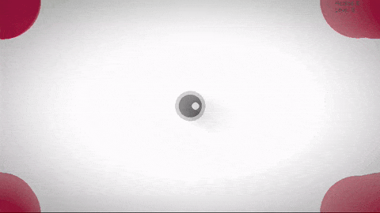

# Tiny Blood Cells

You play as the Observer in this `asteroidlike` top down shooter, but wait you are also the medic i.e. the protector cell that is healing unhealthy cells

> A game jam for Ludum Dare 56's Tiny Creatures theme.


In **Tiny Blood Cells**, you take on the role of a healer, tasked with saving small cell-like creatures scattered across different levels.
Beware, though, as the creatures are infected and can damage you if you're not careful.
Balance your movement, heal the creatures, and survive the challenges ahead!

Visit the official Ludum Dare 56 page for this game: [Ludum Dare 56 Entry](https://ldjam.com/events/ludum-dare/56/$403597) or try [an older link](https://ldjam.com/events/ludum-dare/56/cells-united-tbd)

## Installation

### Requirements

- **LÖVE 11.5 (Mysterious Mysteries)** or higher. You can download it from the official site at [love2d.org](https://love2d.org/).

### Setup Instructions

1. **Clone the Repository or Download ZIP**
   Clone the repository or [download the ZIP](https://github.com/lloydlobo/tinycreatures/archive/refs/heads/main.zip) file containing the game source code.

2. **Ensure LÖVE is Installed**
   If you don't already have LÖVE installed, you can download and install it from [love2d.org](https://love2d.org/) or install it via Homebrew by running:

   ```bash
   brew install love
   ```

### Running the Game

You have two options to run the game:

1. **Using the Terminal:**

   - Open a terminal window.
   - Navigate to the project directory where the game files (including `main.lua` and `conf.lua`) are located:

     ```bash
     cd /path/to/project-directory
     ```

   - Run the game with:

     ```bash
     love .
     ```

   Alternatively, if you have a `.love` file (e.g., `tinybloodcells.love`), you can run:

   ```bash
   love /path/to/tinybloodcells.love
   ```

2. **Drag and Drop:**
   - Drag the project folder or the `.love` file onto the LÖVE executable. This will automatically launch the game.

### Web Build Option

> If you're looking for a way to play the game in a browser, LÖVE doesn't natively support web
> builds. However, you can convert your game using **love.js**, which allows LÖVE games to run in
> browsers. Check with the developer if there's an existing web version of the game or use love.js to
> export it yourself.

---


## Game Controls

- **Arrow Keys/WASD**: Move the player entity.
- **Spacebar**: Fire projectiles.
- **X**: Dash forward.
- **Shift (Left/Right)**: Enhance attributes and increase turning speed.
- **Escape**: ~~Pause~~ or ~~exit~~ force quit.
- **Q**: Force quit.
- **N**: Next level.
- **P**: Previous level.
- **R**: Reset current level.
- **H**: Toggle debug HUD.


## Develop

This game was based on a starter template ported from an Asteroids tutorial at [berbasoft.com](https://berbasoft.com/simplegametutorials/love/asteroids/). During development, we used the following command to reload the game on file changes:

```bash
find -name '*.lua' | entr -crs 'date; love .; echo exit status $?'
```

### Architecture

### Technology

#### Core

- [LÖVE─Source Code](https://github.com/love2d/love)
- [love2d.org](https://love2d.org/)

#### Libraries

[moonshine─Postprocessing effect repository for LÖVE](https://github.com/vrld/moonshine)

#### Key Enumerations

- **ControlKey**: Defines the key bindings for various actions like shooting, movement, and game controls.
- **Status**: Manages the activity status of the creatures.
- **HealthTransitions**: Tracks the healing state of creatures (none, healing, healthy).
- **CreatureStageColor**: Color scheme for different stages of creature evolution.
- **ScreenFlashAlphaLevel**: Defines screen flash transparency for different effects.

---

## Credits

### Testers

- **Seon**

### Resources

Grateful to the following creators for their amazing sound and music contributions:

```text
| Sound/Music                             | Source                                            | Credit                                                                                                                                   |
| --------------------------------------- | ------------------------------------------------- | ---------------------------------------------------------------------------------------------------------------------------------------- |
| **statistics_pickup_coin2_1.wav**       | resources/audio/sfx/statistics_pickup_coin2_1.wav | DASK: Retro sounds [itch.io link](https://dagurasusk.itch.io/retrosounds)                                                                |
| **statistics_pickup_coin2_2.wav**       | resources/audio/sfx/statistics_pickup_coin2_2.wav | DASK: Retro sounds [itch.io link](https://dagurasusk.itch.io/retrosounds)                                                                |
| **machines_guns_turn_off.wav**          | resources/audio/sfx/machines_guns_turn_off.wav    | DASK: Retro sounds [itch.io link](https://dagurasusk.itch.io)                                                                            |
| **machines_interference.wav**           | resources/audio/sfx/machines_interference.wav     | DASK: Retro sounds [itch.io link](https://dagurasusk.itch.io/retrosounds)                                                                |
| **select_sound.wav**                    | resources/audio/sfx/select_sound.wav              | DASK: Retro sounds [itch.io link](https://dagurasusk.itch.io/retrosounds)                                                                |
| **statistics_upgrade.wav**              | resources/audio/sfx/statistics_upgrade.wav        | DASK: Retro sounds [itch.io link](https://dagurasusk.itch.io/retrosounds)                                                                |
| **menu_select.wav**                     | resources/audio/sfx/menu_select.wav               | DASK: Retro sounds [itch.io link](https://dagurasusk.itch.io/retrosounds)                                                                |
| **pickup_holy.wav**                     | resources/audio/sfx/pickup_holy.wav               | DASK: Retro sounds [itch.io link](https://dagurasusk.itch.io/retrosounds)                                                                |
| **Lupus Nocte Arcadewave (background)** | resources/audio/music/lupus_nocte_arcadewave.mp3  | Lupus Nocte: [Epidemic Sound link](http://link.epidemicsound.com/LUPUS) [YouTube link](https://youtu.be/NwyDMDlZrMg?si=oaFxm0LHqGCiUGEC) |
```

### Special thanks

- Twitch streamer among other things, Tkap1 for gifting a last minute invite code!!! Also do check out their game!!
- This game was based on a starter template ported from an Asteroids tutorial at [berbasoft.com](https://berbasoft.com/simplegametutorials/love/asteroids/).

## License

This project is open source under the MIT License. See the LICENSE file for more details.

---

<details>

<summary>Progress so far...</summary>




</details>
