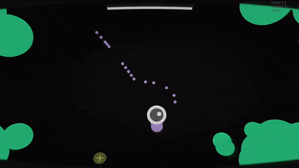
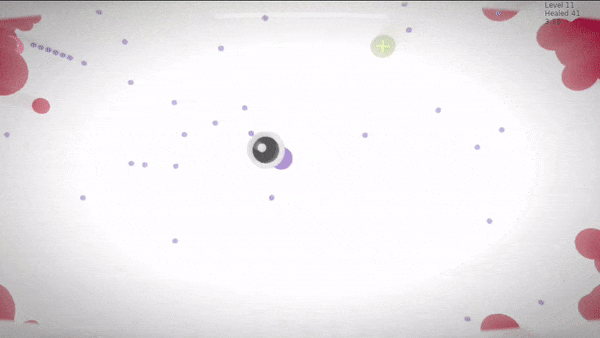
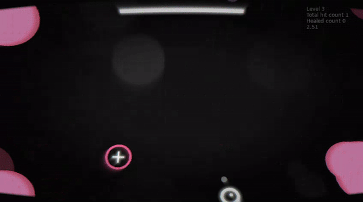
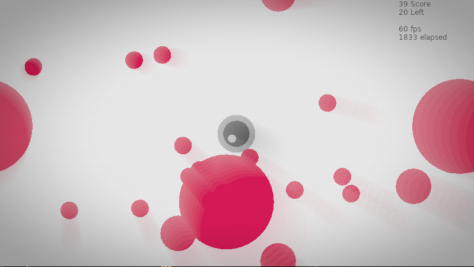
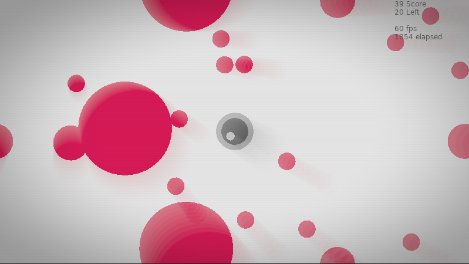
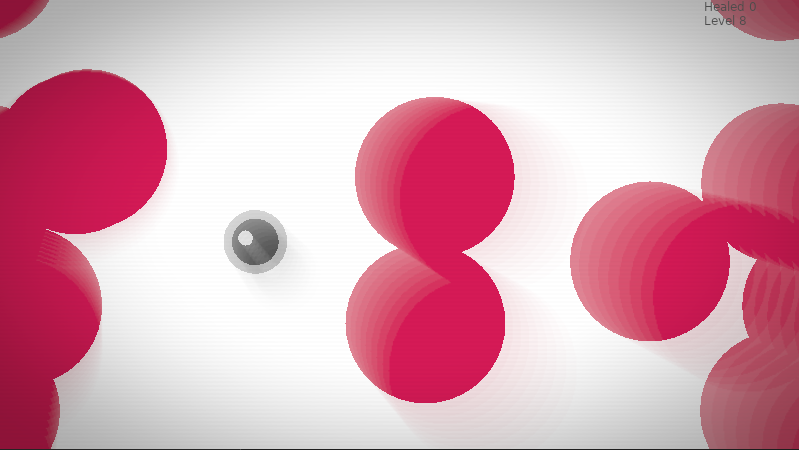
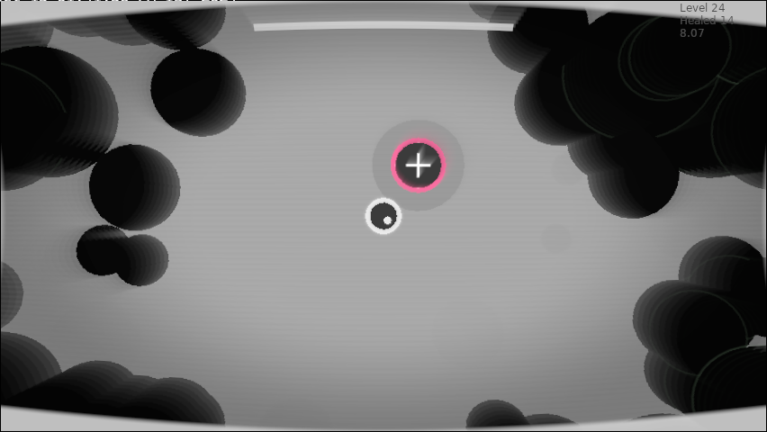
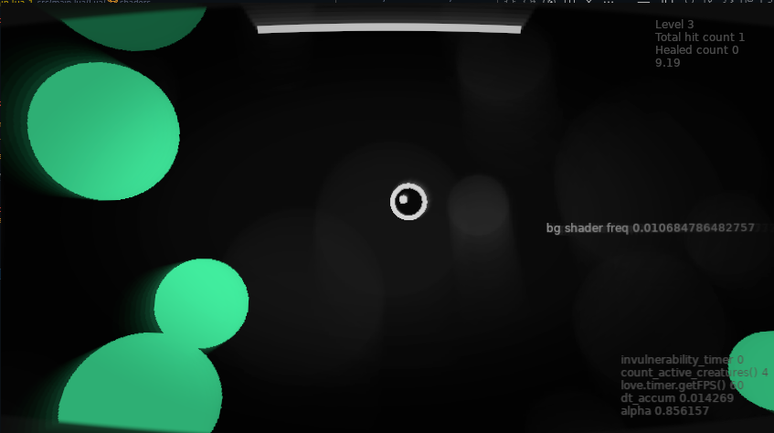

# Tiny Blood Cells

[](https://github.com/lloydlobo/tinycreatures/actions/workflows/test.yml) • [](https://github.com/lloydlobo/tinycreatures/actions/workflows/fmt.yml)

You play as the Observer in this `asteroidlike` top down shooter, but wait you are also the medic i.e. the protector cell that is healing unhealthy cells


> Initially built during a game jam for Ludum Dare 56's Tiny Creatures theme.

In **Tiny Blood Cells**, you take on the role of a healer, tasked with saving small cell-like creatures scattered across different levels.
Beware, though, as the creatures are infected and can damage you if you're not careful.
Balance your movement, heal the creatures, and survive the challenges ahead!

Visit the official Ludum Dare 56 page for this game: [Ludum Dare 56 Entry](https://ldjam.com/events/ludum-dare/56/$403597) or try [an older link](https://ldjam.com/events/ludum-dare/56/cells-united-tbd)

## Table of Contents

- [Tiny Blood Cells](#tiny-blood-cells)
  - [Table of Contents](#table-of-contents)
  - [Installation](#installation)
    - [Requirements](#requirements)
    - [Setup Instructions](#setup-instructions)
    - [Running the Game](#running-the-game)
    - [Web Build Option](#web-build-option)
  - [Game Controls](#game-controls)
  - [Develop](#develop)
  - [Architecture](#architecture)
    - [Technology Used](#technology-used)
      - [Core](#core)
      - [Libraries](#libraries)
      - [Other](#other)
    - [Key Enumerations](#key-enumerations)
  - [Credits](#credits)
    - [Testers](#testers)
    - [Resources](#resources)
      - [Sound Effects](#sound-effects)
      - [Music](#music)
    - [Special thanks](#special-thanks)
  - [License](#license)
  - [Progress so far‥](#progress-so-far)

## Installation

### Requirements

- **LÖVE 11.5 (Mysterious Mysteries)** or higher. You can download it from the official site at [love2d.org](https://love2d.org/).

### Setup Instructions

1. **Clone the Repository or Download ZIP**
   Clone the repository or [download the ZIP](https://github.com/lloydlobo/tinycreatures/archive/refs/heads/main.zip) file containing the game source code.

2. **Ensure LÖVE is Installed**
   If you don't already have LÖVE installed, you can download and install it from [love2d.org](https://love2d.org/) or install it via Homebrew by running:

   ```bash
   brew install love
   ```

### Running the Game

You have two options to run the game:

1. **Using the Terminal:**

   - Open a terminal window.
   - Navigate to the project directory where the game files (including `main.lua` and `conf.lua`) are located:

     ```bash
     cd /path/to/project-directory/src
     ```

   - Run the game with:

     ```bash
     love .
     ```

   Alternatively, if you have a `.love` file (e.g., `tinybloodcells.love`), you can run:

   ```bash
   love /path/to/tinybloodcells.love
   ```

2. **Drag and Drop:**
   - Drag the project folder or the `.love` file onto the LÖVE executable. This will automatically launch the game.

### Web Build Option

> If you're looking for a way to play the game in a browser, LÖVE doesn't natively support web
> builds. However, you can convert your game using **love.js**, which allows LÖVE games to run in
> browsers. Check with the developer if there's an existing web version of the game or use love.js to
> export it yourself.

---


## Game Controls

- **Arrow Keys/WASD**: Move the player entity.
- **Spacebar**: Fire projectiles.
- **X**: Dash forward.
- **Shift (Left/Right)**: Enhance attributes and increase turning speed.
- **Escape**: ~~Pause~~ or ~~exit~~ force quit.
- **H**: Toggle debug HUD.
- **N**: Next level.
- **P**: Previous level.
- **Q**: Force quit.
- **R**: Reset current level.

## Develop

This game evolved from the starter template ported from an _Asteroids_ tutorial at [berbasoft.com](https://berbasoft.com/simplegametutorials/love/asteroids/).

> NOTE: See `Makefile` for quick commands.

## Architecture

### Technology Used

#### Core

- [LÖVE Source Code](https://github.com/love2d/love) • [love2d.org](https://love2d.org/)

#### Libraries

- [moonshine](https://github.com/vrld/moonshine) ─ A postprocessing effect repository for LÖVE

#### Other

- [REAPER](https://www.reaper.fm/) ─ Digital Audio Workstation
- [ezgif](https://ezgif.com) ─ GIF optimizer and compressor

<details>

<summary>Learn more</summary>

### Key Enumerations

- **ControlKey**: Defines the key bindings for various actions like shooting,
  movement, and game controls.
- **Status**: Manages the activity status of the creatures.
- **HealthTransitions**: Tracks the healing state of creatures (none, healing, healthy).
- **CreatureStageColor**: Color scheme for different stages of creature evolution.
- **ScreenFlashAlphaLevel**: Defines screen flash transparency for different effects.

</details>

---

## Credits

### Testers

- **Seon**

### Resources

Grateful to the following creators for their amazing sound and music contributions:

#### Sound Effects

- **DASK**: Retro sounds • [itch.io link](https://dagurasusk.itch.io/retrosounds)

#### Music

- **Lupus Nocte**: Arcadewave (background) • [Epidemic Sound link](http://link.epidemicsound.com/LUPUS) • [YouTube](https://youtu.be/NwyDMDlZrMg?si=oaFxm1LHqGCiUGEC)

### Special thanks

- Twitch Streamer [Tkap1](https://m.twitch.tv/tkap1/home) aka Javier Palacios for gifting a last minute invite code!!!
- This game was based on a starter template ported from an Asteroids tutorial at [berbasoft.com](https://berbasoft.com/simplegametutorials/love/asteroids/).

## License

This project is open source under the MIT License. See the LICENSE file for more details.

---

## Progress so far‥

<details>

<summary>Expand Screencasts</summary>








</details>

<details>

<summary>Expand Screenshots</summary>







</details>
